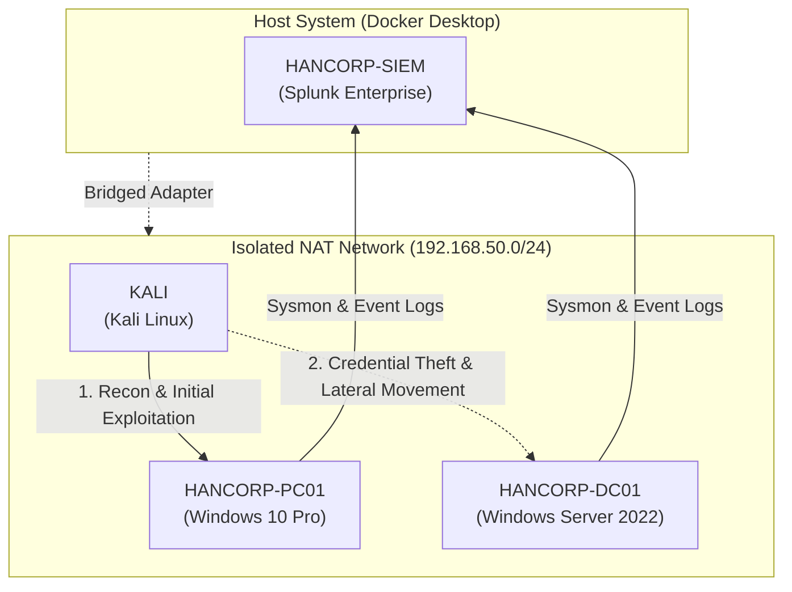

# Hancorp Homelab

  

  
  
  
  
  

An isolated enterprise lab environment designed to emulate an Active Directory domain, simulate real-world attack vectors from Kali Linux, and analyze detection telemetry using Splunk and Wireshark.

**Purpose:** Built to practice Active Directory administration, offensive security fundamentals (Red Team tactics), and detection engineering (Blue Team SOC operations) in a legal, fully isolated environment.

---

## Lab Architecture

---

## Core Security Stack

* **SIEM:** Splunk Enterprise (Windows Event Logs & Sysmon ingestion)
* **Packet Analysis:** Wireshark & TShark (`.pcap` capture and deep packet inspection)
* **Endpoint Telemetry:** Microsoft Sysmon (Process creation, network connections, memory access)

---

## Lab Documentation

* **[Lab Architecture & VM Setup](docs/setup.md)** 
* **[Chapter 1: Brute Force Attack](docs/simulation/01-brute-force.md)**