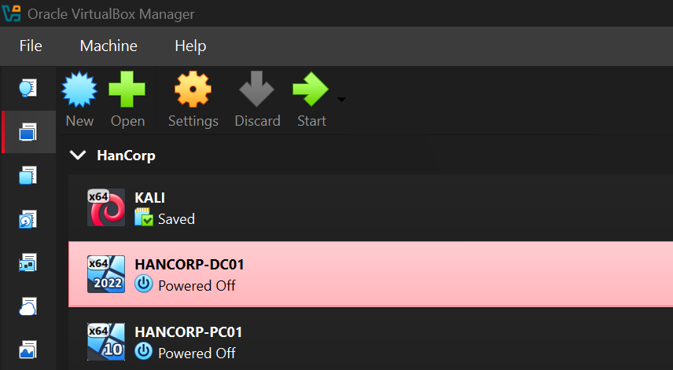
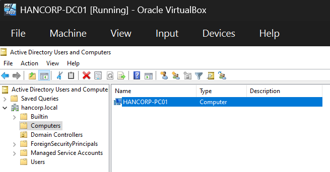
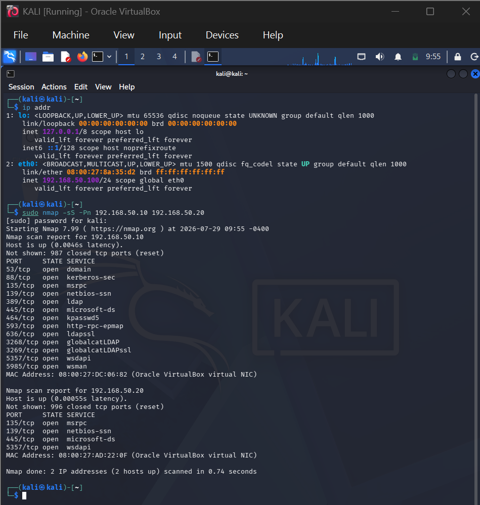
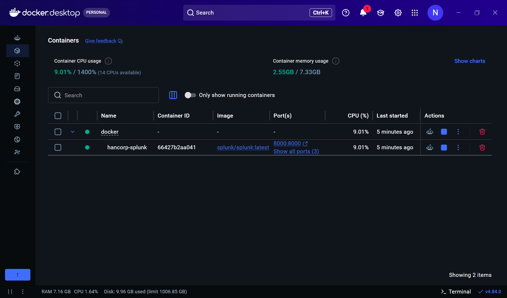
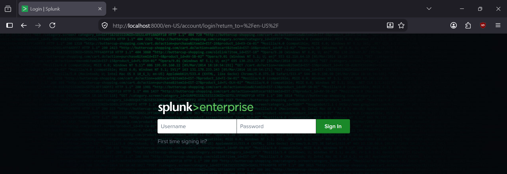
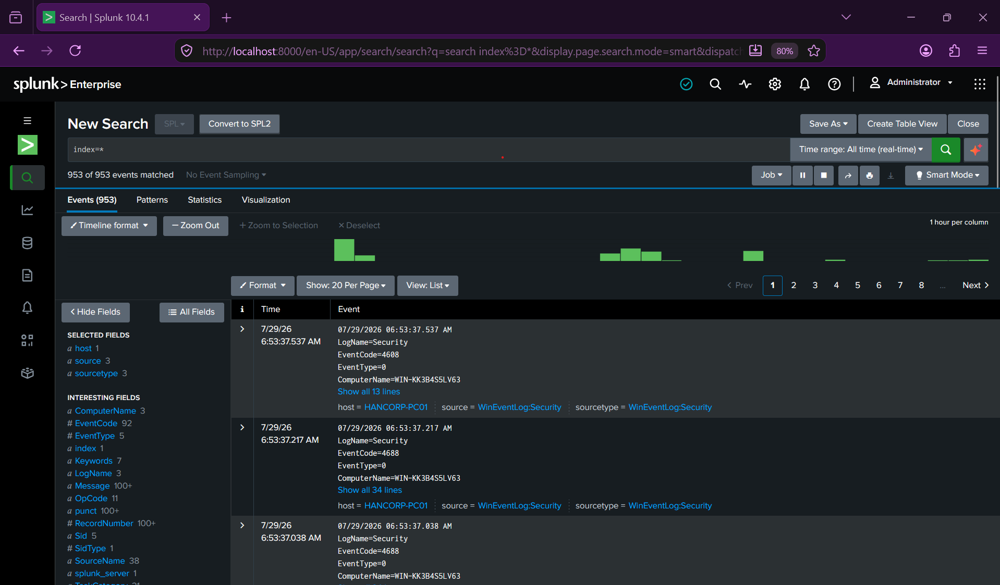

# Hancorp Homelab Setup

## 1. Overview & Architecture

**Hancorporation** is an isolated enterprise home lab designed to emulate a small corporate Active Directory environment (`hancorp.local`). The infrastructure is built using **Oracle VM VirtualBox** for virtualized hosts and **Docker Desktop** for central telemetry collection via Splunk Enterprise.

### Lab Network Properties
* **Subnet:** `192.168.50.0/24` (VirtualBox NAT Network)
* **Domain Name:** `hancorp.local`
* **Default Gateway:** `192.168.50.1`
* **DNS Server:** `192.168.50.10` (`HANCORP-DC01`)

---

## 2. Infrastructure Inventory

| Hostname | Role / OS | IP Address | Subnet Mask | CPU / RAM | Primary Software & Agents |
| :--- | :--- | :--- | :--- | :--- | :--- |
| **`HANCORP-DC01`** | Active Directory DC (Windows Server 2022) | `192.168.50.10` | `255.255.255.0` | 2 vCPU / 4 GB | Active Directory, DNS, Sysmon, Splunk Universal Forwarder |
| **`HANCORP-PC01`** | Victim Endpoint (Windows 10 Pro) | `192.168.50.20` | `255.255.255.0` | 2 vCPU / 4 GB | Sysmon, Splunk Universal Forwarder |
| **`HANCORP-KALI`** | Attacker Machine (Kali Linux) | `192.168.50.100` | `255.255.255.0` | 2 vCPU / 2 GB | Nmap, Metasploit, Hydra, Wireshark |
| **`HANCORP-SIEM`** | Central SIEM (Docker / Host PC) | `192.168.50.1` | `255.255.255.0` | Host Shared | Splunk Enterprise (`8000/TCP`, `9997/TCP`) |

---

## 3. Network Configuration Details

### Isolated NAT Network Configuration
To prevent attack simulations (e.g., automated scanning or exploits) from reaching external networks while allowing inter-VM communication, all virtual machines are bound to a custom VirtualBox **NAT Network** named `HANCORP-NAT-NET`.

* **CIDR Prefix:** `192.168.50.0/24`
* **DHCP:** Disabled (All endpoints use static IP addressing for predictable log attribution).

---

## 4. VM ISO & Hardware Provisioning

### ISO Images Used
* **Windows Server 2022:** `SERVER_EVAL_x64FRE_en-us.iso` (Standard Desktop Experience)
* **Windows 10 Enterprise / Pro:** `Win10_22H2_English_x64.iso`
* **Kali Linux:** `kali-linux-2024.x-installer-amd64.iso`

### Virtual Machine Creation Matrix

#### 1. `HANCORP-DC01` (Domain Controller)
* **OS Type:** Windows / Windows 2022 (64-bit)
* **Base Memory:** 4096 MB (4 GB)
* **Processors:** 2 vCPUs
* **Disk Size:** 50 GB (Dynamically Allocated VDI)
* **Network Adapter 1:** NAT Network (`HANCORP-NAT-NET`)

#### 2. `HANCORP-PC01` (Windows Endpoint)
* **OS Type:** Windows / Windows 10 (64-bit)
* **Base Memory:** 4096 MB (4 GB)
* **Processors:** 2 vCPUs
* **Disk Size:** 50 GB (Dynamically Allocated VDI)
* **Network Adapter 1:** NAT Network (`HANCORP-NAT-NET`)

#### 3. `KALI` (Attacker Machine)
* **OS Type:** Linux / Debian (64-bit)
* **Base Memory:** 2048 MB (2 GB)
* **Processors:** 2 vCPUs
* **Disk Size:** 30 GB (Dynamically Allocated VDI)
* **Network Adapter 1:** NAT Network (`HANCORP-NAT-NET`)

---

## 5. Splunk Configuration (SIEM Stack)

### Container Deployment Specs (`docker-compose.yml`)
* **Container Name:** `hancorp-splunk`
* **Image:** `splunk/splunk:latest`
* **Environment Variables:**
  * `SPLUNK_START_ARGS=--accept-license`
  * `SPLUNK_PASSWORD=Zahancorpvros793`
* **Exposed Ports:** 
  * `8000:8000` (Splunk Web UI)
  * `9997:9997` (Splunk Enterprise Receiver / Port for Universal Forwarders)
* **Volumes:** Persistent mounts mapped to `/opt/splunk/etc` and `/opt/splunk/var` to preserve indexer data and configuration files upon restart.

### Data Inputs & Endpoints
* **Ingestion Receiver:** Port `9997` enabled on Splunk Enterprise.
* **Universal Forwarder Output:** Points to `192.168.50.1:9997` (Host Gateway).
* **Target Sourcetypes:**
  * `XmlWinEventLog:Microsoft-Windows-Sysmon/Operational`
  * `WinEventLog:Security`
  * `WinEventLog:System`

---

## 6. Documentation

### Screenshot 1: NAT Network Configuration

  

### Screenshot 2: Machine List

  

### Screenshot 3: Active Directory Setup

  

### Screenshot 4: NAT Network Test

  

### Screenshot 5: Splunk Docker Container Running

  

### Screenshot 5.1: Splunk Web Interface Running

  

### Screenshot 6: Windows Logs ingested in Splunk

  

