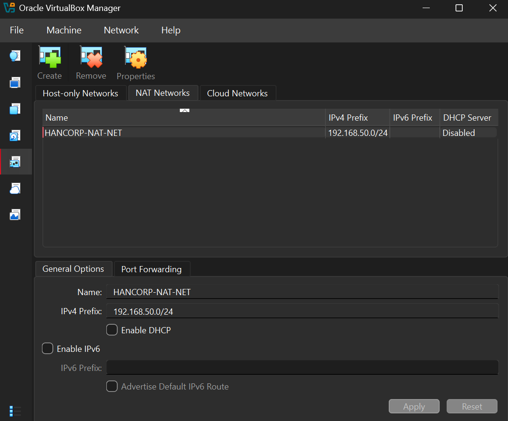

# Hancorp Homelab Setup

## 1. Overview & Architecture

**Hancorporation** is an isolated enterprise home lab designed to emulate a small corporate Active Directory environment (`hancorp.local`). The infrastructure is built using **Oracle VM VirtualBox** for virtualized hosts and **Docker Desktop** for central telemetry collection via Splunk Enterprise.

### Lab Network Properties
* **Subnet:** `192.168.50.0/24` (VirtualBox NAT Network)
* **Domain Name:** `hancorp.local`
* **Default Gateway:** `192.168.50.1`
* **DNS Server:** `192.168.50.10` (`HANCORP-DC01`)

---

## 2. Infrastructure Inventory

| Hostname | Role / OS | IP Address | Subnet Mask | CPU / RAM | Primary Software & Agents |
| :--- | :--- | :--- | :--- | :--- | :--- |
| **`HANCORP-DC01`** | Active Directory DC (Windows Server 2022) | `192.168.50.10` | `255.255.255.0` | 2 vCPU / 4 GB | Active Directory, DNS, Sysmon, Splunk Universal Forwarder |
| **`HANCORP-PC01`** | Victim Endpoint (Windows 10 Pro) | `192.168.50.20` | `255.255.255.0` | 2 vCPU / 4 GB | Sysmon, Splunk Universal Forwarder |
| **`HANCORP-KALI`** | Attacker Machine (Kali Linux) | `192.168.50.100` | `255.255.255.0` | 2 vCPU / 2 GB | Nmap, Metasploit, Hydra, Wireshark |
| **`HANCORP-SIEM`** | Central SIEM (Docker / Host PC) | `192.168.50.5` | `255.255.255.0` | Host Shared | Splunk Enterprise (`8000/TCP`, `9997/TCP`) |

---

## 3. Network Configuration Details

### Isolated NAT Network Configuration
To prevent attack simulations (e.g., automated scanning or exploits) from reaching external networks while allowing inter-VM communication, all virtual machines are bound to a custom VirtualBox **NAT Network** named `HANCORP-NAT-NET`.

* **CIDR Prefix:** `192.168.50.0/24`
* **DHCP:** Disabled (All endpoints use static IP addressing for predictable log attribution).

---

## 4. Verification & Proof of Setup

### Screenshot 1: VirtualBox NAT Network Configuration

  

### Screenshot 2: VirtualBox Manager Machine List
*Shows all active virtual machines (`HANCORP-DC01`, `HANCORP-PC01`, `HANCORP-KALI`) running and attached to the NAT network.*

### Screenshot 3: Active Directory Domain Controller Verification
*Shows the Active Directory Users and Computers (ADUC) dashboard on `HANCORP-DC01` demonstrating `hancorp.local` domain creation.*

### Screenshot 4: End-to-End Network Connectivity Test
*Command output from Kali Linux (`192.168.50.100`) successfully pinging both `HANCORP-DC01` (`192.168.50.10`) and `HANCORP-PC01` (`192.168.50.20`).*

---

## 5. VM ISO & Hardware Provisioning

### ISO Images Used
* **Windows Server 2022:** `SERVER_EVAL_x64FRE_en-us.iso` (Standard Desktop Experience)
* **Windows 10 Enterprise / Pro:** `Win10_22H2_English_x64.iso`
* **Kali Linux:** `kali-linux-2024.x-installer-amd64.iso`

### Virtual Machine Creation Matrix

#### 1. `HANCORP-DC01` (Domain Controller)
* **OS Type:** Windows / Windows 2022 (64-bit)
* **Base Memory:** 4096 MB (4 GB)
* **Processors:** 2 vCPUs
* **Disk Size:** 50 GB (Dynamically Allocated VDI)
* **Network Adapter 1:** NAT Network (`HANCORP-NAT-NET`)

#### 2. `HANCORP-PC01` (Windows Endpoint)
* **OS Type:** Windows / Windows 10 (64-bit)
* **Base Memory:** 4096 MB (4 GB)
* **Processors:** 2 vCPUs
* **Disk Size:** 50 GB (Dynamically Allocated VDI)
* **Network Adapter 1:** NAT Network (`HANCORP-NAT-NET`)

#### 3. `HANCORP-KALI` (Attacker Machine)
* **OS Type:** Linux / Debian (64-bit)
* **Base Memory:** 2048 MB (2 GB)
* **Processors:** 2 vCPUs
* **Disk Size:** 30 GB (Dynamically Allocated VDI)
* **Network Adapter 1:** NAT Network (`HANCORP-NAT-NET`)