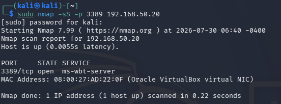
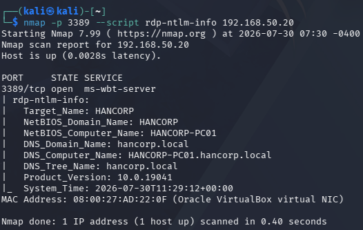
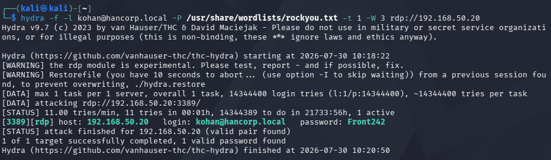
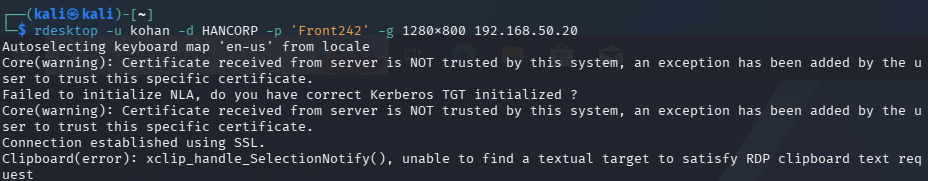
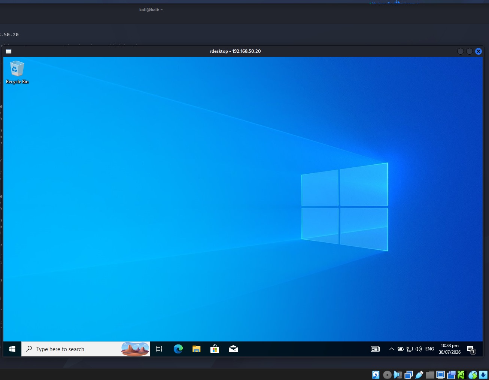
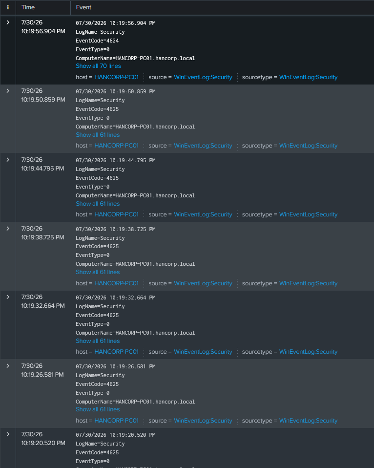
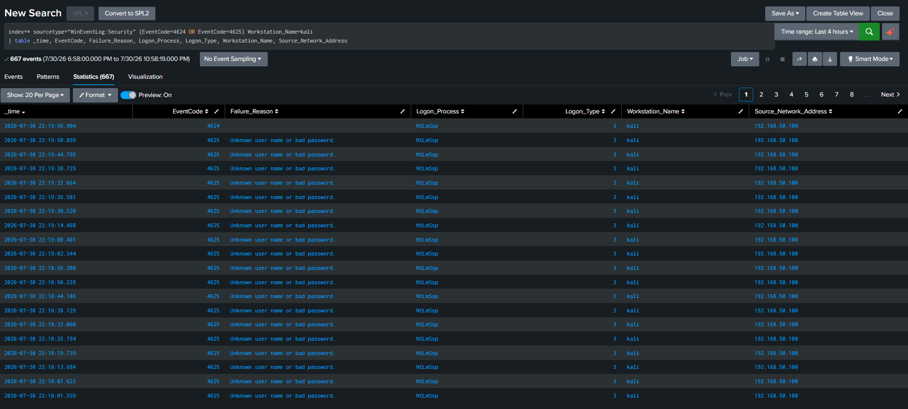
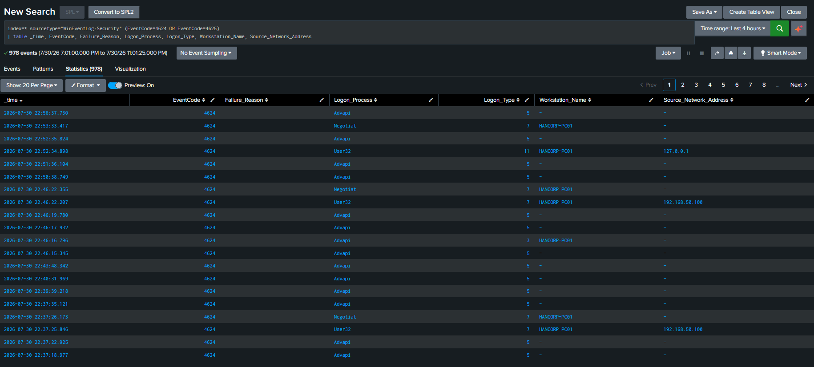

# Chapter 1 - Brute Force Attack

| Field | Detail |
| :--- | :--- |
| **ATT&CK Tactic** | Credential Access |
| **ATT&CK Technique** | T1110.001 (Brute Force: Password Guessing) |
| **Target(s)** | HANCORP-PC01 (192.168.50.20) |
| **Lab Date** | 2026-07-29 |
| **Last Updated** | 2026-07-30 |

---

## Attacker Scenario

> HanCorp is a small startup with roughly 1–3 employees. We were tasked with testing vulnerabilities in their
> Active Directory environment. During reconnaissance, we identified the IP address of an employee
> workstation (`HANCORP-PC01`) exposed to the internal network, and learned that one of the employees
> is named "Kohan" via footprinting, so we'll try to enumerate their password using their name as the
> username. Port scanning revealed RDP (`3389/TCP`) open. Our objective as the attacker is to gain valid
> credentials via brute force and establish initial access to the endpoint.

<p align="center">
   
</p>

---

## RED TEAM - Exploitation

### Tools Used

* Hydra + Wordlists
* rdesktop

### Attack Steps

**1. Domain enumeration**

After the initial nmap scan, we could go straight to brute forcing, but it's good practice to
enumerate the domain first, especially against Active Directory, since some services expect
credentials in `user@domain` format rather than just a bare username. We used nmap's `rdp-ntlm-info`
script, which pulls domain and hostname info out of the RDP/NTLM handshake without needing any
credentials.

<p align="center">
   
</p>

**2. Brute forcing credentials with Hydra**

Hydra is a login-cracking tool that automates the process of trying many username/password
combinations against a service until one works. It supports RDP, SSH, FTP, HTTP forms, and dozens of
other protocols. Rather than trying a true brute force attack, we ran a **dictionary attack**, which means feeding Hydra a wordlist of real, commonly-used passwords and letting it work through the list against the known username. This is much faster than a full brute force but only works if the actual password happens to be in the wordlist.

Quick side note on labeling this properly: since we went in with one known username against a live,
online login prompt (not cracking hashes offline, not throwing a bunch of usernames at the wall), the
official term for this flavor of attack is Password Guessing, technique T1110.001 under the broader
T1110 Brute Force family. Same idea, just the more precise name for it.

> In a real environment, cracking a password this fast is very unrealistic unless
> the password were especially weak or already leaked. We kept it simple here to
> move the lab along. This IS just a practice lab after all.

<p align="center">
   
</p>

**3. Establishing initial access with rdesktop**

rdesktop is an open-source RDP client for Linux that lets us open a graphical remote desktop session
against a Windows host, same as a legitimate user would. Now that we have valid credentials, we can
directly and got an interactive session on HANCORP-PC01.

One thing worth flagging here: when we connected, rdesktop threw a warning that it couldn't set up NLA
("Network Level Authentication") and just fell back to a plain connection instead. That's not just
noise in the terminal, it's a sign the workstation wasn't requiring that extra identity check before
letting a session start, and it's part of why this whole attack went as smoothly as it did. More on
that in the Mitigation section below.

<p align="center">
   
</p>
<p align="center">
   
</p>

---

## Defense Scenario

> During a slow day at work, we identified multiple login attempts on one of our PCs. We assumed the
> user was unaware that their PC had been targeted. We investigate the issue before the attacker can
> move further up toward the server admin.

---

## BLUE TEAM - Detection

### Expectations

* Suspicious stream of security events coded `4625` (failed logon) followed by a `4624` (successful
  logon), basically a LOT of failures ending in one success is a sign of bruteforcing.

### Splunk Logs

<p align="center">
   
</p>

Expectations are right, the events shows repeated `4625` failures on HANCORP-PC01 ending in
a single `4624` success. We need to visualize it more clearly.

### Detailed Logs

**Ingested Bruteforce logs**

**QUERY**
```spl
index=* sourcetype="WinEventLog:Security" (EventCode=4624 OR EventCode=4625) Workstation_Name=kali
| table _time, EventCode, Failure_Reason, Logon_Process, Logon_Type, Workstation_Name, Source_Network_Address
```

Filtering straight to `Workstation_Name=kali` cuts out everything else on the box and leaves just what we care about: a wall of `4625` failures with the same "unknown user name or bad password" reason, repeated dozens of times in under a minute, then one `4624` success at the very top. That kind of speed and repetition is not a person fat fingering their password, that is a script doing the work.

<p align="center">
   
</p>

**Ingested Successful logins**

**QUERY**
```spl
index=* sourcetype="WinEventLog:Security" (EventCode=4624 OR EventCode=4625)
| table _time, EventCode, Failure_Reason, Logon_Process, Logon_Type, Workstation_Name, Source_Network_Address
```

This one pulls everything on the host, not just the attacker traffic, so most of what's on screen is normal background noise like service logons and session checks. But scroll or filter down and you'll land on the pair that matters: `192.168.50.100` (the Kali box) tied to the failed attempts and the final success, sitting right next to `127.0.0.1`, which is the real user logging into their own machine locally like normal. A legit user does not remote into their own PC over the network, so that mismatch is the giveaway once you dig past the noise.

<p align="center">
   
</p>


Two more small details back this up. First, the `Logon_Process` field on the bad entries reads `NtLmSsp`, meaning the connection went through NTLM instead of Kerberos, which lines up with the NLA warning we saw earlier on the attacker side. Same root problem, showing up twice in two different places. Second, and honestly the funniest part, the `Workstation_Name` field just says "kali." The attacker's own machine name shows up in the victim's logs. An IP address can be spoofed or hidden behind a VPN, but that is about as caught red handed as it gets.

---

## Mitigation & Defense

* Cut inbound connections to the account/attacker IP immediately as a containment step.
* Hop on the domain controller and disable the compromised (pwned) user.
* Reset credentials for any pwned users, and rotate anywhere that password was reused.
* Apply an account lockout policy to prevent unwanted brute forcing, e.g. a short timeout after 3
  failed attempts in a row, and a full lockout requiring domain controller intervention after 10.
* Turn on Network Level Authentication (NLA) for every machine that has RDP enabled. In plain terms,
  NLA makes a user prove who they are before the remote desktop session even opens, instead of after.
  That means fewer resources wasted on random login attempts and one less door left open for tools like
  Hydra to knock on. This has been a recommended default setting for a while now, and HANCORP-PC01
  wasn't enforcing it, which made this attack easier than it should have been.
* Enable MFA where possible. Newer Windows/AD environments support this natively and it defeats
  password-only brute forcing even against a weak password.
* Since RDP is common in companies, keep it patched and treat it as a priority attack surface.
* Restrict remote access (RDP and similar) to the IT department only, standard employee workstations
  generally shouldn't expose it to the wider internal network.

---

## 6. References

* [MITRE ATT&CK T1110 - Brute Force](https://attack.mitre.org/techniques/T1110/)
* [MITRE ATT&CK T1110.001 - Password Guessing](https://attack.mitre.org/techniques/T1110/001/)