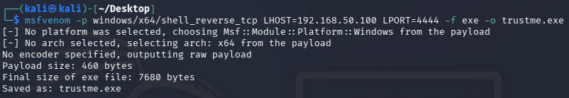
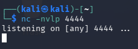
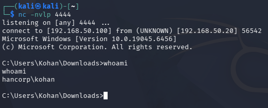
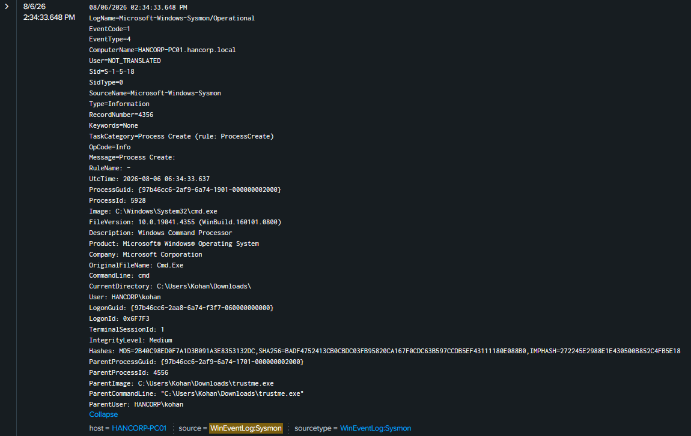
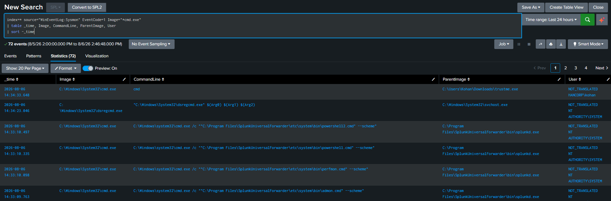
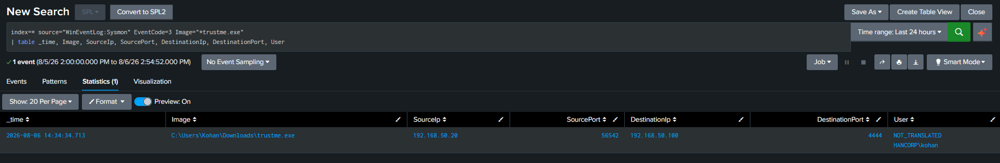
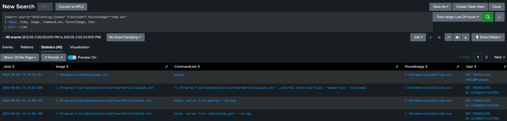

# Chapter 2 - Reverse Shell

| Field | Detail |
| :--- | :--- |
| **ATT&CK Tactic** | Execution, Command and Control |
| **ATT&CK Technique** | T1059 (Command and Scripting Interpreter), T1095 (Non-Application Layer Protocol) |
| **Target(s)** | HANCORP-PC01 (192.168.50.20) |
| **Lab Date** | 2026-08-06 |
| **Last Updated** | 2026-08-06 |

---

## Attacker Scenario

> Our task is to establish a reverse shell against one of the employee workstations. Delivery
> isn't the focus of this chapter, we're not simulating phishing or social engineering here, we
> just need a working listener and a payload that calls back successfully. Once we have a shell,
> we'll run a basic command to confirm access and move on to the Blue Team side.

---

## RED TEAM - Exploitation

### Tools Used

* msfvenom
* netcat

### Attack Steps

**1. Generating the payload**

We used msfvenom to generate a raw Windows reverse shell payload, pointed back at our Kali
machine on port 4444. Unlike a Meterpreter payload, a raw `shell_reverse_tcp` payload just opens
a plain command shell back to the listener. No special handler is needed on the catching end,
netcat is enough.

<p align="center">
   
</p>

**2. Setting up the listener**

On Kali, we set up netcat to listen for the incoming connection:

```bash
nc -nvlp 4444
```

`-n` skips DNS resolution, `-v` gives us verbose output so we can see the connection land,
`-l` puts netcat into listen mode, and `-p 4444` binds it to the port our payload is configured
to call back to. From here it just sits and waits.

<p align="center">
   
</p>

**3. Delivery and execution**

The payload (`trustme.exe`) was pulled down to `C:\Users\Kohan\Downloads\` and executed manually
to simulate a user unknowingly running it. The moment it ran, our netcat listener caught the
callback and dropped us into an interactive shell running as `HANCORP\kohan`. We confirmed access
with a simple `whoami`.

<p align="center">
   
</p>

---

## Defense Scenario

> We noticed unusual outbound traffic from PC01 to an unfamiliar internal host. We need to trace
> back what started it, find the executable responsible, and confirm whether it's actively
> beaconing out.

---

## BLUE TEAM - Detection

### Expectations

* Sysmon Event ID 1 (Process Creation): an unfamiliar binary spawning `cmd.exe` from a
  user-writable path like `Downloads`, instead of `cmd.exe` being launched normally by a user
* Sysmon Event ID 3 (Network Connection): that same binary reaching out to an unfamiliar internal
  IP on a non-standard port
* Sysmon Event ID 1 again, this time for whatever gets typed inside that shell, showing up as a
  child process of the spawned `cmd.exe`

### Splunk Logs

Starting broad with all Event ID 1 process creation on the host and sorting by time, one entry
immediately stands out near the top: `cmd.exe` with a parent of `C:\Users\Kohan\Downloads\trustme.exe`.
A `.exe` sitting in a user's Downloads folder spawning a command shell on its own, with no user
typing `cmd` themselves, is not normal behavior. Everything else in the surrounding results is
expected noise (Splunk's own forwarder invoking `cmd.exe` internally, `dsregcmd` running under
`svchost`), which is exactly why this one entry is the standout.

<p align="center">
   
</p>

### Detailed Logs

**Payload execution: tracing the parent process**

**QUERY**
```spl
index=* source="WinEventLog:Sysmon" EventCode=1 Image="*cmd.exe"
| table _time, Image, CommandLine, ParentImage, User
| sort -_time
```

This confirms it: at `2026-08-06 14:34:33`, `cmd.exe` was launched with `ParentImage` set to
`C:\Users\Kohan\Downloads\trustme.exe`, running as `HANCORP\kohan`. A legitimate `cmd.exe` is
almost always spawned by a user directly (Explorer, a shortcut, another shell) or by a known
system process, never by a randomly-named executable sitting in Downloads. That parent-child
relationship is the single strongest indicator in this whole chapter. The filename `trustme.exe`
is almost a joke at this point, but the real tell is architectural: an unknown binary is spawning
an interactive shell.

<p align="center">
   
</p>

**Outbound beacon connection**

**QUERY**
```spl
index=* source="WinEventLog:Sysmon" EventCode=3 Image="*trustme.exe"
| table _time, Image, SourceIp, SourcePort, DestinationIp, DestinationPort, User
```

This is where the "unfamiliar outbound traffic" from our scenario gets confirmed. `trustme.exe`
initiated a connection from PC01 (`192.168.50.20`) out to `192.168.50.100` on port `4444`, which
is our Kali attacker machine. This is a textbook C2 beacon signature: the connection originates
*from* the victim *outward*, which is exactly why reverse shells are effective against standard
inbound firewall rules. Nothing had to be opened on PC01 for this to work, PC01 reached out on
its own. The destination IP being unfamiliar to this host's normal traffic pattern, combined with
the non-standard high port, is the giveaway here.

<p align="center">
   
</p>

**What the attacker did inside the shell**

**QUERY**
```spl
index=* source="WinEventLog:Sysmon" EventCode=1 ParentImage="*cmd.exe"
| table _time, Image, CommandLine, ParentImage, User
| sort -_time
```

Anything typed inside a reverse shell isn't logged as keystrokes, it shows up as a new child
process of that `cmd.exe` instance. Filtering to children of `cmd.exe` and sorting by time, we
can see `whoami.exe` executed at `14:34:54`, seconds after the shell was established, run as
`HANCORP\kohan`. This query pulls in some unrelated noise too (Splunk's own internal `cmd.exe`
children like `btool` and `splunk.exe`), so in a larger environment this would need to be scoped
down further by `ParentProcessId` to isolate only the malicious shell's children specifically,
rather than every `cmd.exe` on the box.

<p align="center">
   
</p>

---

## Mitigation & Defense

* Application whitelisting to block unsigned/unknown binaries from executing, especially from
  user-writable paths like `Downloads`, `Public`, or `Temp`
* Egress filtering: restrict outbound traffic to only known-necessary ports/destinations instead
  of allowing PC01 unrestricted outbound access
* EDR/AV signature and behavioral detection for known payload frameworks (Metasploit payloads are
  heavily signatured by most modern AV)
* Network segmentation: standard employee workstations shouldn't have unrestricted reach to
  arbitrary internal or external hosts
* Alert on outbound connections to non-standard high ports from workstations that have no business
  making them
* Alert on any non-system binary spawning `cmd.exe` or `powershell.exe`, this parent-child
  relationship is one of the most reliable indicators of shell-based access

---

## References

* [MITRE ATT&CK T1059 - Command and Scripting Interpreter](https://attack.mitre.org/techniques/T1059/)
* [MITRE ATT&CK T1095 - Non-Application Layer Protocol](https://attack.mitre.org/techniques/T1095/)